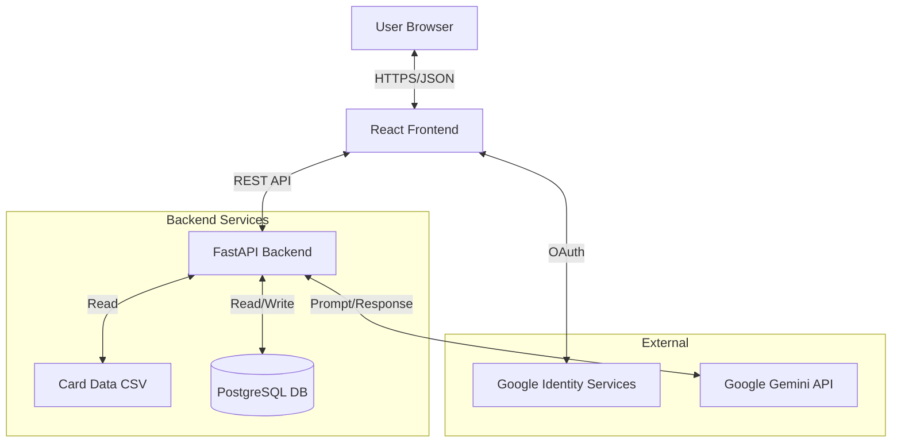

# GGLTCG - Googooland Trading Card Game


A tactical two-player card game with no randomness in draws—only skill and strategy.

## Project Overview

GGLTCG is a web application for playing the Googooland Trading Card Game,
either against an AI opponent or with friends online. The rules and cards
are fully implemented in the backend game engine, with a React frontend
for lobby, gameplay, and stats.

### Who is this for?

- **TCG Enthusiasts**: Explore a deterministic, skill-based card game engine.
- **AI Developers**: See how LLMs (Google Gemini) can be integrated as game agents.
- **Full-Stack Engineers**: A reference for modern Python/React apps with enterprise-grade practices.

## 5-Minute Quickstart

1. **Clone & Setup Backend**:

   ```bash
   git clone https://github.com/RegisCA/ggltcg.git
   cd ggltcg/backend
   python3.13 -m venv .venv && source .venv/bin/activate
   pip install -r requirements.txt
   cp .env.example .env  # Add your GOOGLE_API_KEY
   python run_server.py
   ```

2. **Setup Frontend**:

   ```bash
   cd ../frontend
   npm install
   cp .env.example .env.local  # Add VITE_GOOGLE_CLIENT_ID
   npm run dev
   ```

3. **Play**: Open <http://localhost:5173>

## Key Features

- **1v1 Online Multiplayer**: Lobby system to create and join private games by code.
- **Quick Play vs AI**: Start a game against the AI with a single click.
- **Google OAuth Authentication**: Secure sign-in with Google, user profiles, and display names.
- **LLM-Powered AI Opponent**: Uses Google Gemini for strategic, rules-aware play.
- **Persistent Stats**: PostgreSQL-backed tracking of game results and high-level stats.
- **Deterministic Gameplay**: No random draws – only visible information and player decisions.
- **Data-Driven Cards**: Card stats and effects defined in CSV, parsed by a generic effect system.
- **Type-Safe Architecture**: TypeScript frontend and Pydantic-validated FastAPI backend.

## Documentation

For detailed documentation, see the **[Documentation Index](docs/README.md)**. Key guides include:

- [Architecture](docs/development/ARCHITECTURE.md)
- [Effect System](docs/development/EFFECT_SYSTEM_ARCHITECTURE.md)
- [Authentication](docs/development/AUTH_IMPLEMENTATION.md)

## Security

- **Authentication**: Google OAuth only (no passwords stored).
- **Secrets**: Managed via environment variables.
- **Reporting**: See [SECURITY.md](SECURITY.md) for reporting vulnerabilities.
- **Guidelines**: See [Security Instructions](.github/instructions/security-and-owasp.instructions.md).

## Production Engineering

This project demonstrates professional software engineering practices:

- **Database Migrations**: Uses **Alembic** for reliable schema evolution and version control of the database.
- **Automated Maintenance**: Background tasks automatically clean up abandoned games and stale logs to keep the database healthy.
- **Operational Security**: Maintenance endpoints are secured with API keys; user data is protected via OAuth 2.0.
- **Scalable Architecture**: Stateless backend design allows for horizontal scaling (deployed on Render).

## Architecture



## Tech Stack

### Backend

- **Python 3.13** with FastAPI 0.115.6
- **PostgreSQL** database with SQLAlchemy & Alembic
- Uvicorn 0.34.0 ASGI server
- Card data stored in CSV format (Single Source of Truth)
- Game state management with JSON serialization
- AI player powered by Google Gemini (free tier available)
- **Deployed on Render.com** (free tier)

### Frontend

- **React 19** with TypeScript
- **Vite 7.2.2** for fast development
- **React Query** (@tanstack/react-query) for server state management
- **Axios** for HTTP client
- **TailwindCSS 4.1** for styling
- Dark theme UI with responsive design
- **Deployed on Vercel** (free tier)

## Live Demo

**Play now:** <https://ggltcg.vercel.app>

**Backend API:** <https://ggltcg.onrender.com>

- API docs: <https://ggltcg.onrender.com/docs>
- Health check: <https://ggltcg.onrender.com/health>

*Note: Backend on Render's free tier may take 50 seconds to wake up from inactivity.*

## Project Structure

```mermaid
ggltcg/
├── backend/
│   ├── src/
│   │   ├── game_engine/
│   │   │   ├── models/          # Card, Player, GameState classes
│   │   │   ├── rules/           # Game logic, turn management, tussles
│   │   │   │   └── effects/     # Card effect system (18 cards)
│   │   │   ├── ai/              # LLM player integration (Gemini/Claude)
│   │   │   └── data/            # Card loader, CSV handling
│   │   └── api/                 # FastAPI routes (9 endpoints)
│   ├── data/
│   │   └── cards.csv            # 18-card starter pack (SINGLE SOURCE OF TRUTH)
│   ├── tests/
│   └── requirements.txt
├── frontend/
│   ├── src/
│   │   ├── components/          # React UI components (6 components)
│   │   ├── hooks/               # React Query hooks
│   │   ├── api/                 # API client
│   │   ├── types/               # TypeScript definitions
│   │   └── App.tsx
│   ├── public/
│   └── package.json
├── docs/
│   ├── rules/                   # Game rules documentation
│   └── development/             # Architecture, effects, auth, deployment
├── .github/instructions/        # Coding, security, and testing guidelines
└── README.md
```

## Development Setup

### Prerequisites

- Python 3.13+
- Node.js 18+
- Google Gemini API key (get one free at <https://aistudio.google.com/api-keys>)

### Backend Setup

```bash
cd backend
python -m venv .venv
source .venv/bin/activate  # On macOS/Linux; use .venv\Scripts\activate on Windows
pip install -r requirements.txt

# Copy example env files if present, then configure auth and DB
cp .env.example .env 2>/dev/null || true
```

Then set at minimum:

- `DATABASE_URL` – PostgreSQL connection string
- `GOOGLE_CLIENT_ID`, `GOOGLE_CLIENT_SECRET` – OAuth credentials
- `JWT_SECRET_KEY` – random secret for JWTs
- `ALLOWED_ORIGINS` – allowed frontend origins

For details, see `docs/development/ENV_VARS_AUTH.md` and
`docs/development/DATABASE_SCHEMA.md`.

### Frontend Setup

```bash
cd frontend
npm install
```

Create a `.env` file in `frontend/` with at least:

- `VITE_API_URL` – URL of the backend (e.g. `http://localhost:8000`)
- `VITE_GOOGLE_CLIENT_ID` – OAuth client ID

See `docs/development/AUTH_IMPLEMENTATION.md` and
`docs/development/FRONTEND_OVERVIEW.md` for more context.

### Running the Application

**Backend:**

```bash
source .venv/bin/activate  # From project root, if not already active

cd backend
python run_server.py

# Server runs at http://localhost:8000
# API docs at http://localhost:8000/docs
```

**Command Line Options:**

The backend server supports the following command-line arguments:

- `--deck PATH`: Path to a custom deck CSV file (default: `backend/data/cards.csv`)
- `--host HOST`: Host to bind the server to (default: `0.0.0.0`)
- `--port PORT`: Port to bind the server to (default: `8000`)
- `--no-reload`: Disable auto-reload on code changes

Example with custom deck and different port:

```bash
python run_server.py --deck-csv my_custom_deck.csv --port 8080
```

**Frontend:**

```bash
cd frontend
npm run dev
# App runs at http://localhost:5173
```

Open <http://localhost:5173> in your browser to play.

## Card Data

Card definitions live in `backend/data/cards.csv` and are the single
source of truth for card stats, colors, and effect strings. The effect
system is data-driven and parses the `effects` column into runtime
effect objects.

For details on adding or modifying cards, see:

- `docs/development/ADDING_NEW_CARDS.md`
- `docs/development/EFFECT_SYSTEM_ARCHITECTURE.md`

## Game Rules

- **Objective:** Put all opponent's cards into their Sleep Zone.
- **Turn Start:** Gain 4 CC (Player 1 on Turn 1 gains only 2).
- **CC Cap:** Maximum 7 CC per player at any time.
- **Tussle:** Pay CC to have two Toys fight. Higher speed strikes first.

See `docs/rules/GGLTCG Rules v1_1.md` for complete rules.

## Deployment

The application is deployed and live:

- **Frontend:** <https://ggltcg.vercel.app> (Vercel)
- **Backend:** <https://ggltcg.onrender.com> (Render.com)

For deployment instructions, see:

- `docs/deployment/DEPLOYMENT.md` – Complete step-by-step deployment guide
- `docs/deployment/DEPLOYMENT_QUICKSTART.md` – Quick reference for common tasks

Both services run on free tiers. Note that the Render backend may take ~50 seconds to wake up from inactivity.

## Troubleshooting

- Backend/API: check `http://localhost:8000/health` and the FastAPI docs at `/docs`.
- Frontend: inspect browser console and verify `VITE_API_URL` points to the backend.
- Auth: confirm Google OAuth credentials and env vars as per
    `docs/development/GOOGLE_OAUTH_SETUP.md` and `AUTH_IMPLEMENTATION.md`.

- The code automatically retries with exponential backoff (1s, 2s, 4s)

**Rate Limit Exceeded:**

- Check your usage at <https://aistudio.google.com/usage>
- Free tier limits: 15 requests per minute (RPM) for most models
- Wait 1 minute and try again, or slow down gameplay

**AI Not Making Decisions:**

- Check backend terminal for detailed logs showing Gemini API calls
- Logs include prompts, responses, and error details
- Look for ERROR or WARNING messages in the output

**Using Alternative LLM Providers:**

- This project supports multiple LLM providers (Gemini, Claude, etc.)
- See `backend/AI_SETUP.md` for detailed setup instructions for each provider
- Gemini is recommended for development due to its generous free tier

## Development Roadmap

### Phase 1: MVP Foundation ✅ COMPLETE

- [x] Project setup and structure
- [x] Core game engine (card loading, game state)
- [x] Turn management and CC system
- [x] Tussle resolution
- [x] Card effect system (all 18 cards)
- [x] FastAPI REST API (9 endpoints)
- [x] React + TypeScript UI
- [x] AI player integration (Gemini)
- [x] **First complete game played: November 10, 2025** 🎉

### Phase 2: Production Polish ✅ COMPLETE

- [x] Automated deck picker with slider (Issue #19)
- [x] Victory screen with play-by-play and AI reasoning (Issue #20)
- [x] Medium-sized hand cards showing effects (Issue #22)
- [x] Player name customization (Issue #23)
- [x] Narrative "bedtime story" mode (Issue #21)
- [x] Backend CSV as single source of truth
- [x] Production-ready code cleanup
- [x] **Deployed to production** (Render + Vercel)

### Phase 3: Deployment & Documentation ✅ COMPLETE

- [x] Backend deployment to Render.com
- [x] Frontend deployment to Vercel
- [x] Environment variable configuration
- [x] CORS security setup
- [x] Comprehensive deployment documentation
- [x] Live at <https://ggltcg.vercel.app>

### Phase 4: Future Enhancements

- [ ] Card animations and visual effects
- [ ] Sound effects
- [ ] Game replay system
- [ ] Statistics and match history
- [ ] Additional card sets

## Contributing

This project is developed using GitHub Copilot. See `docs/dev-notes/COPILOT_CONTEXT.md` for development guidelines and context.

## License

This project is licensed under the **GNU Affero General Public License v3.0 (AGPL-3.0)**.

This means you are free to use, modify, and distribute this software, provided that any modifications are also made open source under the same license. If you run this software on a network server, you must provide the source code to users of that server.

**Commercial Licensing:**
If you wish to use this software in a proprietary product or without the obligations of the AGPL-3.0, commercial licenses are available. Please contact the maintainers for more information.

See the [LICENSE](LICENSE) file for details.
