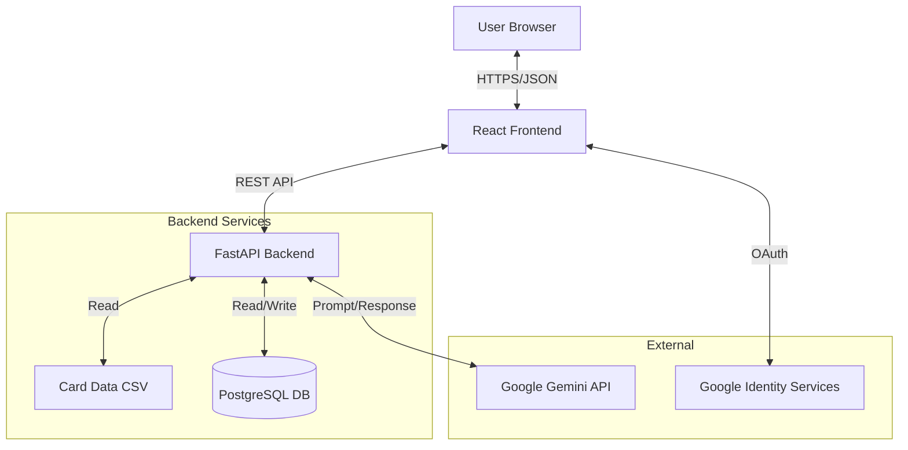
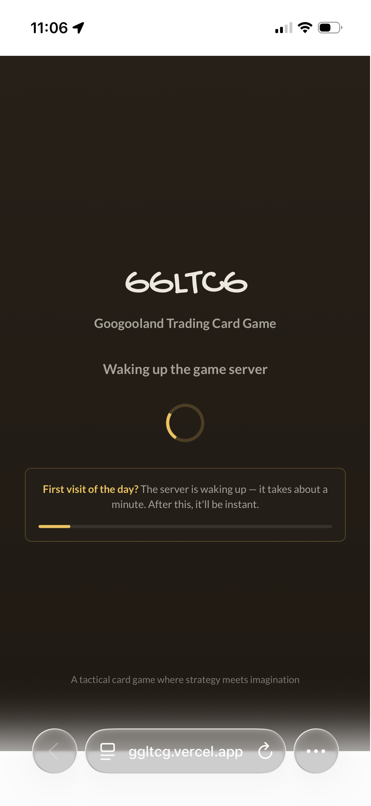
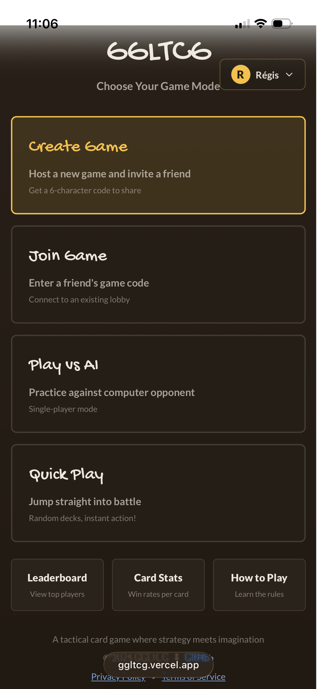
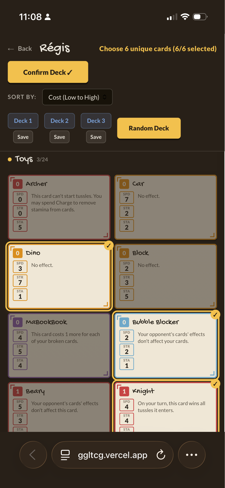
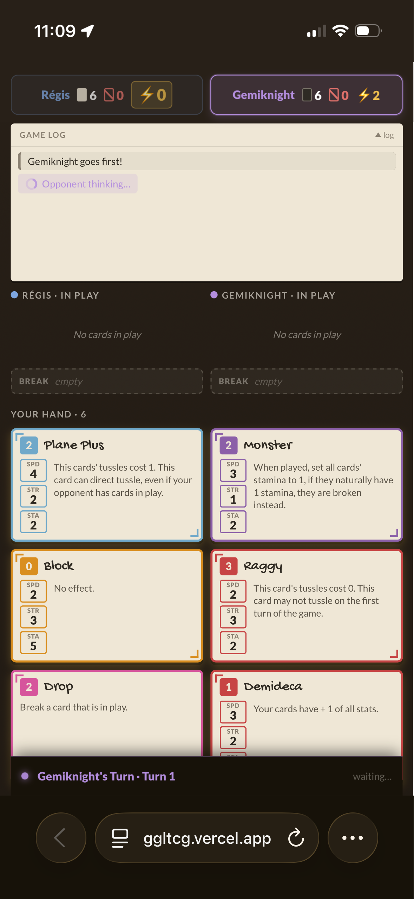
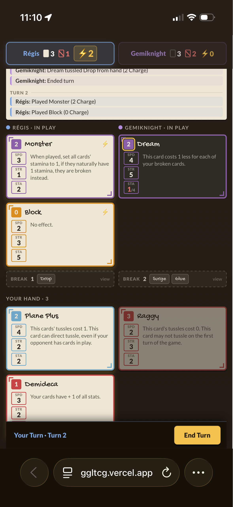
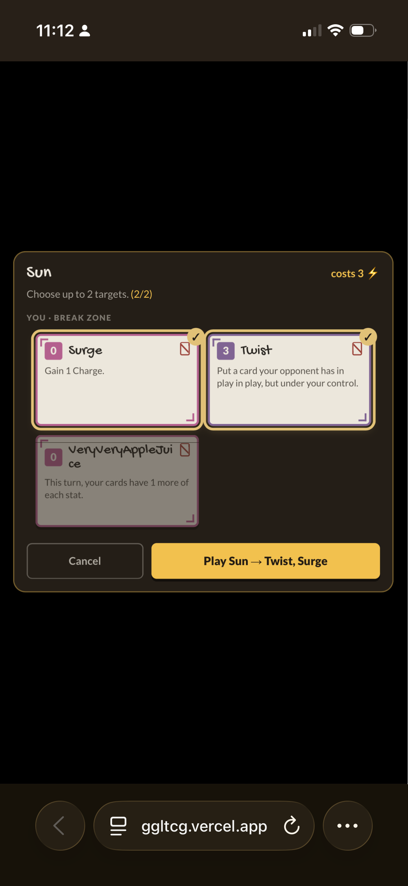

# GGLTCG — Googooland Trading Card Game


[](https://ggltcg.vercel.app)

A tactical two-player card game with no randomness in draws — only skill and
strategy. **[Play it live](https://ggltcg.vercel.app)** (the free-tier backend
may take ~50s to wake on first load).

GGLTCG is a full web app: a backend game engine with the rules and cards fully
implemented, a React frontend for lobby, gameplay, and stats, and an
LLM-powered AI opponent.

**Before → after** — the same board, three weeks apart, after a July 2026
"Paper & Ink" redesign:

 

*Previous UI (left) vs. current UI (right).*

**Who is this for?**

- **TCG enthusiasts** — a deterministic, skill-based card game engine.
- **AI developers** — a worked example of integrating an LLM (Google Gemini) as a game agent.
- **Full-stack engineers** — a reference for a modern Python/React app: typed end to end, migration-managed, CI-gated.

## How this was built

I didn't hand-write this code. I directed its construction — the architecture,
the scope, and the engineering decisions — using AI coding agents under a
structured workflow ([AGENTS.md](AGENTS.md)).

What makes that work rather than "an AI generating code" is matching a
specialized tool to each kind of thinking — planning, implementing, play-testing,
visual design, multi-resolution verification — and holding dozens of small,
reviewed changes pointed in one direction. The full account, with before/after
screenshots and the tool-to-task breakdown, is in the retrospective:
[**From Audit to Rebuild, in Two Weekends**](docs/RETROSPECTIVE.md).

The clearest example of the judgment involved is the AI opponent. It went through
four architectures before settling on one:

```
enumerate every engine-legal sequence  →  1 Gemini call picks the best  →  execute
```

Because every sequence is engine-legal by construction, illegal moves became
impossible rather than merely caught — so the elaborate validator that used to
guard against bad model output had nothing left to reject, and was deleted along
with the multi-provider abstraction and the mode flags no one could keep
straight. The subsystem that was the project's biggest liability became its most
predictable, at exactly one model call per turn. The decision trail is in
[AI_CURRENT_STATE.md](docs/development/ai/AI_CURRENT_STATE.md).

## Who built this

Engineer by training — Diplôme d'Ingénieur (ENSIIE, France) and MSc in Computer
Science (University of Hull) — who architects and directs software rather than
hand-writing it. Alongside the building: fifteen-plus years delivering software
and scaling the client-facing side of it, including product ownership on an
Innovative Solutions Canada (ISED) contract and building and running global
client-services organizations.

GGLTCG is one exhibit — proof I can take a system from nothing to deployed,
making the architectural and AI-engineering calls by directing agents and tools.
It's a slice of a larger track record: [LinkedIn](http://linkedin.com/in/regiseloi).

## Highlights

- **LLM-powered AI opponent** — plans a whole turn via a deterministic
  enumerator plus a single Google Gemini call, using native structured output.
  See [How this was built](#how-this-was-built) for the architecture.
- **1v1 online multiplayer** — a lobby system to create and join private games
  by code, plus one-click Quick Play against the AI.
- **Google OAuth authentication** — secure sign-in, user profiles, and display
  names; no passwords stored.
- **Data-driven cards** — card stats and effects defined in CSV, parsed by a
  generic effect system.
- **Persistent stats** — PostgreSQL-backed tracking of game results.
- **Type-safe throughout** — a TypeScript frontend and a Pydantic-validated
  FastAPI backend.

## Architecture


```mermaid
graph TD
    User[User Browser] <-->|HTTPS/JSON| Frontend[React Frontend]
    Frontend <-->|REST API| Backend[FastAPI Backend]
    Backend <-->|Read| CSV[Card Data CSV]
    Backend <-->|Prompt/Response| LLM[Google Gemini API]
    Backend <-->|Read/Write| DB[(PostgreSQL DB)]
    Frontend <-->|OAuth| Google[Google Identity Services]

    subgraph "Backend Services"
        Backend
        CSV
        DB
    end

    subgraph "External"
        LLM
        Google
    end
```

### Tech stack

**Backend**

- **Python 3.13** with FastAPI 0.115.6
- **PostgreSQL** with SQLAlchemy & Alembic migrations
- Uvicorn 0.34.0 ASGI server
- Card data stored in CSV format (single source of truth)
- Game state management with JSON serialization
- AI player powered by Google Gemini (free tier available)
- Deployed on Render.com (free tier)

**Frontend**

- **React 19** with TypeScript
- **Vite 7.2.2** for fast development
- **React Query** (@tanstack/react-query) for server-state management
- **Axios** for the HTTP client
- **TailwindCSS 4.1** for styling
- **"Paper & Ink" design system** — a hand-drawn, crayon-accented card-game
  aesthetic with a token-based theme (`frontend/src/index.css`), responsive at
  phone/tablet/desktop widths
- **Design-preview harness** (`/design.html`) — every screen renders against
  canned fixtures with no backend, for fast visual iteration
- Deployed on Vercel (free tier)

### Repository layout

```text
ggltcg/
├── backend/
│   ├── src/
│   │   ├── game_engine/
│   │   │   ├── models/          # Card, Player, GameState classes
│   │   │   ├── rules/           # Game logic, turn management, tussles
│   │   │   │   └── effects/     # Card effect system (40 cards)
│   │   │   ├── ai/              # LLM player (single enumerate→choose path)
│   │   │   └── data/            # Card loader, CSV handling
│   │   └── api/                 # FastAPI routes
│   ├── data/
│   │   └── cards.csv            # 40-card set (SINGLE SOURCE OF TRUTH)
│   ├── tests/
│   └── requirements.txt
├── frontend/
│   ├── src/
│   │   ├── components/          # React UI components
│   │   ├── hooks/               # React Query hooks
│   │   ├── api/                 # API client
│   │   ├── types/               # TypeScript definitions
│   │   └── App.tsx
│   ├── public/
│   └── package.json
├── docs/
│   ├── plans/                   # Active development plans
│   ├── rules/                   # Game rules documentation
│   └── development/             # Architecture, effects, AI system
├── .github/instructions/        # Coding, security, and testing guidelines
└── README.md
```

## Simulation system

Automated AI-vs-AI gameplay for testing and analysis. Key use cases:

- **AI testing** — validate AI performance and surface bugs across many games
- **Model comparison** — compare LLM models (e.g. Gemini 2.0 Flash vs 2.5 Flash Lite)
- **Deck balancing** — test matchups to identify imbalances
- **Performance analysis** — track Charge efficiency and turn-by-turn decisions

```bash
cd backend/src
python -m simulation.cli baseline --iterations 10
```

This runs a baseline AI-vs-AI test across standard decks. For details, see the
[Simulation System Guide](docs/development/SIMULATION_SYSTEM.md) and the
[CLI README](backend/src/simulation/README.md). Mind your Google AI Studio rate
limits.

## Game rules

- **Objective** — put all of the opponent's cards into their Break Zone.
- **Turn start** — gain 4 Charge (Player 1 on Turn 1 gains only 2).
- **Charge cap** — a maximum of 7 Charge per player at any time.
- **Tussle** — pay Charge to have two Toys fight; higher speed strikes first.

See [GGLTCG Rules v1_1.md](docs/rules/GGLTCG%20Rules%20v1_1.md) for the complete rules.

## Run it locally

### Prerequisites

- Python 3.13+
- Node.js 18+
- A Google Gemini API key (free at <https://aistudio.google.com/api-keys>)

### Quick start

```bash
# 1. Backend — from the repo root (the venv lives at the root, not in backend/)
git clone https://github.com/RegisCA/ggltcg.git
cd ggltcg
python3.13 -m venv .venv && source .venv/bin/activate
pip install -r backend/requirements.txt
cp backend/.env.example backend/.env   # add at least GOOGLE_API_KEY
cd backend && python run_server.py      # http://localhost:8000  (API docs at /docs)
```

```bash
# 2. Frontend — in a second terminal
cd frontend
npm install
cp .env.example .env.local              # add VITE_GOOGLE_CLIENT_ID
npm run dev                             # http://localhost:5173
```

Then open <http://localhost:5173> to play.

### Configuration

For online play and OAuth (beyond a local AI-only game), set the full
environment:

**Backend** (`backend/.env`)

- `DATABASE_URL` — PostgreSQL connection string
- `GOOGLE_CLIENT_ID`, `GOOGLE_CLIENT_SECRET` — OAuth credentials
- `JWT_SECRET_KEY` — random secret for JWTs
- `ALLOWED_ORIGINS` — allowed frontend origins
- `GOOGLE_API_KEY` — Gemini API key (for the AI opponent)

**Frontend** (`frontend/.env` or `.env.local`)

- `VITE_API_URL` — backend URL (e.g. `http://localhost:8000`)
- `VITE_GOOGLE_CLIENT_ID` — OAuth client ID

For more, see `docs/development/DATABASE_SCHEMA.md`,
`docs/development/AUTH_IMPLEMENTATION.md`, and
`docs/development/FRONTEND_OVERVIEW.md`.

### Command-line options

`run_server.py` accepts:

- `--deck PATH` — custom deck CSV (default: `backend/data/cards.csv`)
- `--host HOST` — host to bind (default: `0.0.0.0`)
- `--port PORT` — port to bind (default: `8000`)
- `--no-reload` — disable auto-reload on code changes

```bash
python run_server.py --deck my_custom_deck.csv --port 8080
```

## Live app & API

**Live game:** <https://ggltcg.vercel.app> — the backend may take up to 50
seconds to wake on first load (free-tier hosting).

**Backend API:** <https://ggltcg.onrender.com>

- API docs: <https://ggltcg.onrender.com/docs>
- Health check: <https://ggltcg.onrender.com/health>

**Current UI walkthrough (mobile):**








1. Server wake screen — first visit of the day, while the free-tier backend is cold-starting.
2. Game mode selection — Create Game, Join Game, Play vs AI, or Quick Play.
3. Deck builder — choosing 6 unique cards, with sortable browsing and deck slots.
4. Opening hand — turn 1, waiting on the AI opponent's move.
5. Game board (mobile) — mid-game state with Break Zones and the game log.
6. Target selection modal — choosing targets when playing a card with an effect.

## Card data

Card definitions live in `backend/data/cards.csv` and are the single source of
truth for card stats, colors, and effect strings. The effect system is
data-driven and parses the `effects` column into runtime effect objects.

For adding or modifying cards, see `docs/development/ADDING_NEW_CARDS.md` and
`docs/development/EFFECT_SYSTEM_ARCHITECTURE.md`.

## Documentation

See the **[Documentation Index](docs/README.md)**. Key guides:

- [Architecture](docs/development/ARCHITECTURE.md)
- [Effect System](docs/development/EFFECT_SYSTEM_ARCHITECTURE.md)
- [Authentication](docs/development/AUTH_IMPLEMENTATION.md)

## Deployment

For deploying your own instance:

- [DEPLOYMENT.md](docs/deployment/DEPLOYMENT.md) — complete deployment guide
- [DEPLOYMENT_QUICKSTART.md](docs/deployment/DEPLOYMENT_QUICKSTART.md) — quick reference

The live instance runs on Vercel (frontend, free tier) and Render.com (backend,
free tier).

## Security

- **Authentication** — Google OAuth only (no passwords stored).
- **Secrets** — managed via environment variables.
- **Reporting** — see [SECURITY.md](SECURITY.md) for reporting vulnerabilities.
- **Guidelines** — see [Security Instructions](.github/instructions/security-and-owasp.instructions.md).

## Contributing

Contributions are welcome. See [CONTRIBUTING.md](CONTRIBUTING.md) for development
setup, coding standards, the pull-request process, and security practices.

## License

Licensed under the **GNU Affero General Public License v3.0 (AGPL-3.0)**. You are
free to use, modify, and distribute this software, provided modifications are
released open-source under the same license; if you run it on a network server,
you must provide the source to that server's users.

**Commercial licensing:** if you wish to use this software in a proprietary
product or without the AGPL-3.0 obligations, commercial licenses are available —
contact the maintainers.

See the [LICENSE](LICENSE) file for details.
