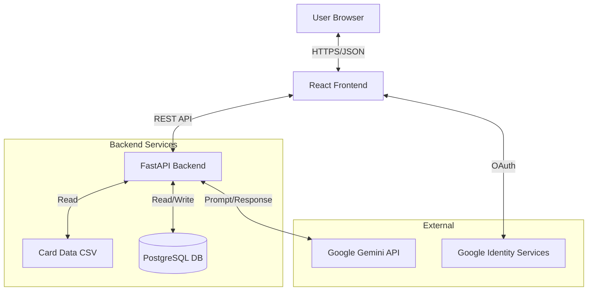

# GGLTCG - Googooland Trading Card Game


A tactical two-player card game with no randomness in draws—only skill
and strategy.

## Project Overview

GGLTCG is a web application for playing the Googooland Trading Card Game,
either against an AI opponent or with friends online. The rules and cards
are fully implemented in the backend game engine, with a React frontend
for lobby, gameplay, and stats.

### Who is this for?

- **TCG Enthusiasts**: Explore a deterministic, skill-based card game engine.
- **AI Developers**: See how LLMs (Google Gemini) can be integrated
  as game agents.
- **Full-Stack Engineers**: A reference for modern Python/React apps
  with enterprise-grade practices.

## 5-Minute Quickstart

1. **Clone & Setup Backend**:

   ```bash
   git clone https://github.com/RegisCA/ggltcg.git
   cd ggltcg/backend
   python3.13 -m venv .venv && source .venv/bin/activate
   pip install -r requirements.txt
   cp .env.example .env  # Add your GOOGLE_API_KEY
   python run_server.py
   ```

2. **Setup Frontend**:

   ```bash
   cd ../frontend
   npm install
   cp .env.example .env.local  # Add VITE_GOOGLE_CLIENT_ID
   npm run dev
   ```

3. **Play**: Open <http://localhost:5173>

## Key Features

- **1v1 Online Multiplayer**: Lobby system to create and join private games by code.
- **Quick Play vs AI**: Start a game against the AI with a single click.
- **Google OAuth Authentication**: Secure sign-in with Google, user
  profiles, and display names.
- **LLM-Powered AI Opponent (v3)**: Two-phase turn planning—the LLM 
  generates a complete turn plan with threat assessment and action 
  sequence at turn start, then heuristic matching executes actions.
  Uses Google Gemini with **native structured output** for reliable play.
- **CC Efficiency Tracking**: Monitors command counter usage per turn
  to analyze AI performance and strategy effectiveness.
- **Persistent Stats**: PostgreSQL-backed tracking of game results and
  high-level stats.
- **Deterministic Gameplay**: No random draws – only visible information
  and player decisions.
- **Data-Driven Cards**: Card stats and effects defined in CSV,
  parsed by a generic effect system.
- **Type-Safe Architecture**: TypeScript frontend and
  Pydantic-validated FastAPI backend.

## Documentation

For detailed documentation, see the
**[Documentation Index](docs/README.md)**. Key guides include:

- [Architecture](docs/development/ARCHITECTURE.md)
- [Effect System](docs/development/EFFECT_SYSTEM_ARCHITECTURE.md)
- [Authentication](docs/development/AUTH_IMPLEMENTATION.md)

## Security

- **Authentication**: Google OAuth only (no passwords stored).
- **Secrets**: Managed via environment variables.
- **Reporting**: See [SECURITY.md](SECURITY.md) for reporting vulnerabilities.
- **Guidelines**: See [Security Instructions](.github/instructions/security-and-owasp.instructions.md).

## Production Engineering

This project demonstrates professional software engineering practices:

- **Database Migrations**: Uses **Alembic** for reliable schema evolution
  and version control of the database.
- **Automated Maintenance**: Background tasks automatically clean up
  abandoned games and stale logs to keep the database healthy.
- **Operational Security**: Maintenance endpoints are secured with API
  keys; user data is protected via OAuth 2.0.
- **Scalable Architecture**: Stateless backend design allows for
  horizontal scaling (deployed on Render).

## Architecture



## Tech Stack

### Backend

- **Python 3.13** with FastAPI 0.115.6
- **PostgreSQL** database with SQLAlchemy & Alembic
- Uvicorn 0.34.0 ASGI server
- Card data stored in CSV format (Single Source of Truth)
- Game state management with JSON serialization
- AI player powered by Google Gemini
  (free tier available)
- **Deployed on Render.com** (free tier)

### Frontend

- **React 19** with TypeScript
- **Vite 7.2.2** for fast development
- **React Query** (@tanstack/react-query) for server state management
- **Axios** for HTTP client
- **TailwindCSS 4.1** for styling
- Dark theme UI with responsive design
- **Deployed on Vercel** (free tier)

## Game Rules

- **Objective:** Put all opponent's cards into their Sleep Zone.
- **Turn Start:** Gain 4 CC (Player 1 on Turn 1 gains only 2).
- **CC Cap:** Maximum 7 CC per player at any time.
- **Tussle:** Pay CC to have two Toys fight. Higher speed strikes first.

See [GGLTCG Rules v1_1.md](docs/rules/GGLTCG%20Rules%20v1_1.md) for complete rules.

## Play Now

**Live Game:** <https://ggltcg.vercel.app>

*Note: The backend may take up to 50 seconds to wake up on first
load (free tier hosting).*

**Backend API:** <https://ggltcg.onrender.com>

- API docs: <https://ggltcg.onrender.com/docs>
- Health check: <https://ggltcg.onrender.com/health>

**Screenshots:**


## Project Structure

```text
ggltcg/
├── backend/
│   ├── src/
│   │   ├── game_engine/
│   │   │   ├── models/          # Card, Player, GameState classes
│   │   │   ├── rules/           # Game logic, turn management, tussles
│   │   │   │   └── effects/     # Card effect system (27 cards)
│   │   │   ├── ai/              # LLM player integration (Gemini)
│   │   │   └── data/            # Card loader, CSV handling
│   │   └── api/                 # FastAPI routes (37 endpoints)
│   ├── data/
│   │   └── cards.csv            # 27-card set (SINGLE SOURCE OF TRUTH)
│   ├── tests/
│   └── requirements.txt
├── frontend/
│   ├── src/
│   │   ├── components/          # React UI components (34 components)
│   │   ├── hooks/               # React Query hooks
│   │   ├── api/                 # API client
│   │   ├── types/               # TypeScript definitions
│   │   └── App.tsx
│   ├── public/
│   └── package.json
├── docs/
│   ├── rules/                   # Game rules documentation
│   └── development/             # Architecture, effects, auth, deployment
├── .github/instructions/        # Coding, security, and testing guidelines
└── README.md
```

## Development Setup

### Prerequisites

- Python 3.13+
- Node.js 18+
- Google Gemini API key (get one free at
  <https://aistudio.google.com/api-keys>)

### Backend Setup

```bash
cd backend
python -m venv .venv
source .venv/bin/activate  # On macOS/Linux; use .venv\Scripts\activate on Windows
pip install -r requirements.txt

# Copy example env files if present, then configure auth and DB
cp .env.example .env 2>/dev/null || true
```

Then set at minimum:

- `DATABASE_URL` – PostgreSQL connection string
- `GOOGLE_CLIENT_ID`, `GOOGLE_CLIENT_SECRET` – OAuth credentials
- `JWT_SECRET_KEY` – random secret for JWTs
- `ALLOWED_ORIGINS` – allowed frontend origins

For details, see `docs/development/ENV_VARS_AUTH.md` and
`docs/development/DATABASE_SCHEMA.md`.

### Frontend Setup

```bash
cd frontend
npm install
```

Create a `.env` file in `frontend/` with at least:

- `VITE_API_URL` – URL of the backend (e.g. `http://localhost:8000`)
- `VITE_GOOGLE_CLIENT_ID` – OAuth client ID

See `docs/development/AUTH_IMPLEMENTATION.md` and
`docs/development/FRONTEND_OVERVIEW.md` for more context.

### Running the Application

**Backend:**

```bash
source .venv/bin/activate  # From project root, if not already active

cd backend
python run_server.py

# Server runs at http://localhost:8000
# API docs at http://localhost:8000/docs
```

**Command Line Options:**

The backend server supports the following command-line arguments:

- `--deck PATH`: Path to a custom deck CSV file (default: `backend/data/cards.csv`)
- `--host HOST`: Host to bind the server to (default: `0.0.0.0`)
- `--port PORT`: Port to bind the server to (default: `8000`)
- `--no-reload`: Disable auto-reload on code changes

Example with custom deck and different port:

```bash
python run_server.py --deck-csv my_custom_deck.csv --port 8080
```

**Frontend:**

```bash
cd frontend
npm run dev
# App runs at http://localhost:5173
```

Open <http://localhost:5173> in your browser to play.

## Card Data

Card definitions live in `backend/data/cards.csv` and are the single
source of truth for card stats, colors, and effect strings. The effect
system is data-driven and parses the `effects` column into runtime
effect objects.

For details on adding or modifying cards, see:

- `docs/development/ADDING_NEW_CARDS.md`
- `docs/development/EFFECT_SYSTEM_ARCHITECTURE.md`

## Deployment

For deploying your own instance:

- [DEPLOYMENT.md](docs/deployment/DEPLOYMENT.md) – Complete deployment guide
- [DEPLOYMENT_QUICKSTART.md](docs/deployment/DEPLOYMENT_QUICKSTART.md) – Quick reference

The live instance runs on:

- **Frontend:** Vercel (free tier)
- **Backend:** Render.com (free tier)

## Contributing

Contributions are welcome! Please see [CONTRIBUTING.md](CONTRIBUTING.md) for:

- Development setup instructions
- Coding standards and guidelines
- Pull request process
- Security best practices

## License

This project is licensed under the **GNU Affero General Public License v3.0 (AGPL-3.0)**.

This means you are free to use, modify, and distribute this software,
provided that any modifications are also made open source under the
same license. If you run this software on a network server, you must
provide the source code to users of that server.

**Commercial Licensing:**
If you wish to use this software in a proprietary product or without
the obligations of the AGPL-3.0, commercial licenses are available.
Please contact the maintainers for more information.

See the [LICENSE](LICENSE) file for details.
