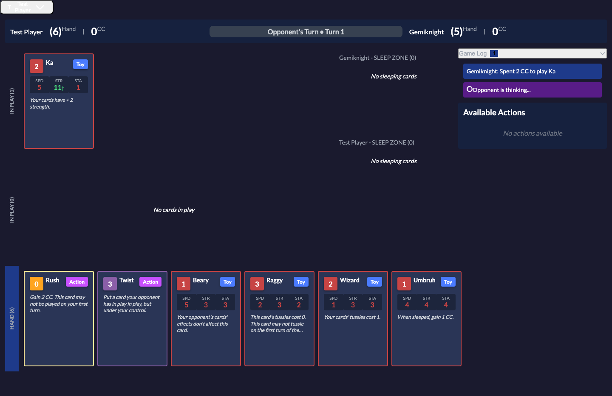
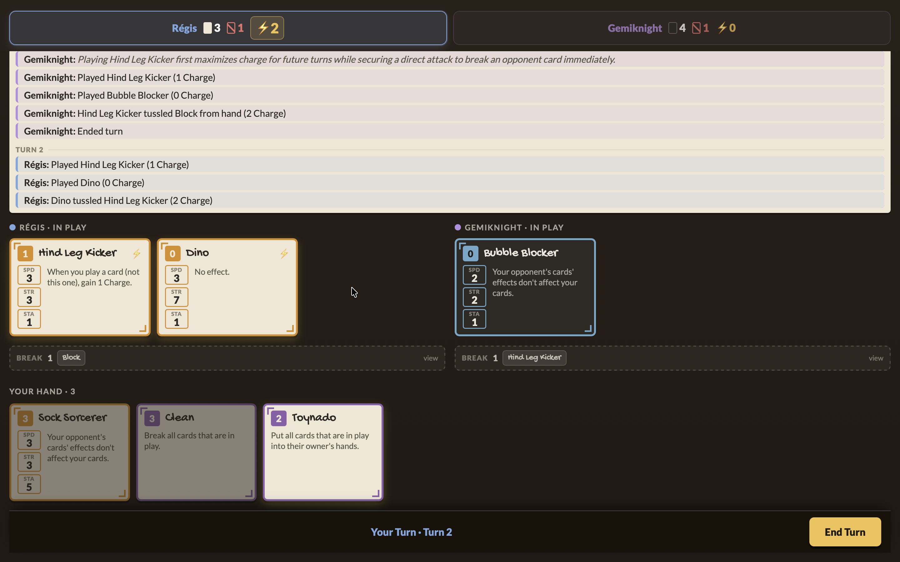

# From Audit to Rebuild, in Two Weekends

**A retrospective on GGLTCG, June–July 2026.**

This is a solo project, and this document is deliberately transparent about that —
including about how it was built. Over roughly two weekends, a June codebase audit
turned into 66 merged pull requests: an AI player rebuilt down to a single
deterministic architecture, and a full visual redesign grounded in how the game is
actually played. The point of writing it down isn't the line count. It's that the
work stayed *coherent* across all 66 changes — and that the leverage came from
matching a specialized tool to each kind of thinking, not from "an AI generating
code."

> A styled version of this report (dark tabletop, the game's own "Paper & Ink"
> palette) was also produced as a standalone page. This markdown is the canonical,
> version-controlled copy.

---

## By the numbers

Measured from the last audit-session commit (PR #329) to the July 5 head.

| | |
|---|---|
| **PRs merged** | 66 (#330 → #395) |
| **Change** | +20,645 / −18,173 lines across 256 files |
| **AI layer** | net **−3.5k lines** — it got smaller *and* simpler |
| **Frontend** | +8,707 / −3,960 lines (the rebuild) |
| **Cards** | 30 → 40 |
| **Frontend tests** | 0 → 15 files (the repo's first) |
| **Open issues** | a full backlog → **0** |
| **People** | one · **Time** | ~2 weekends |

---

## The arc

The June audit read the project as three layers of maturity: a **stable game engine**
worth forking, an **AI player rebuilt so many times it confused even its author**, and
a **dormant simulation harness**. The recommendation was to make the engine genuinely
inheritable and to stop the AI from thrashing — replace the LLM's guess-work with
computation the engine could do exactly.

That happened, and then it kept going. The AI wasn't just fixed — it was **pruned to a
single architecture** and became the cleanest subsystem in the repo. The documentation
stopped lying about how the code works. And a second, larger effort no one planned in
June — a full visual rebuild grounded in real play — turned a generic dark-mode TCG
into something with its own identity.

---

## Before / after — the same board, mid-game

**Before** — the audit-era interface: a generic navy TCG shell. Every playable card
appeared *twice* (a full card in hand, and a numbered row in an "Available Actions"
sidebar), zones were labelled in engine terms, and nothing told you whose cards were
whose except a border color.



**After** — the same match state, rebuilt in the "Paper & Ink" design system:



| Before | | After |
|---|:-:|---|
| Card in hand *and* a numbered sidebar row | → | The card is the only control |
| Border color + "Yours / Theirs" labels | → | Your cards are cream **paper**; theirs are dark **ink** |
| "SLEEP ZONE", "CC", Toy/Action pills | → | Break Zone, **Charge**, anatomy you read at a glance |
| "Opponent is thinking…" spinner | → | The AI announces its plan, then plays it out |
| One desktop layout, broken on phones | → | One CSS grid, tested 390 → 1280px automatically |

The log line in the "after" shot — *"Playing Hind Leg Kicker first maximizes charge
for future turns while securing a direct attack"* — is the rebuilt AI's own reasoning,
surfaced to the player. The two rebuilds meet here: a deterministic engine enumerates
every legal line, one Gemini call picks the best, and the interface narrates it.

---

## The audit action list, closed out

The audit ended with a prioritized list of things to do before the project was
contributor-ready. Every substantive item shipped; the one deferral is named as such.

| # | Item | Status |
|---|------|--------|
| 1 | **Documentation truth pass** — stale architecture/effect-system docs (they described a name-based effect registry that no longer exists) rewritten against the real CSV-driven model; one authoritative AI doc replaced the contradictory ones. | ✅ Shipped |
| 2 | **Dead-code sweep** — beyond the planned removals, a first-ever `vulture`/`knip` scan (hand-verified) cut the legacy `EffectRegistry` path, orphaned components, and duplicate cleanup logic. One PR alone was +19/−1351. | ✅ Shipped |
| 3 | **The "HLK" phantom-card bug** — a card name matching nothing, silently mis-crediting Charge, plus dead planner knowledge around it. Fixed and pinned with a test tying the tables to `cards.csv`. | ✅ Shipped |
| 4 | **Centralize AI card metadata** — the Charge-gain table had been hand-copied into four files and was *already drifting*. Now derived from `cards.csv` at import in one module. | ✅ Shipped |
| 5 | **Test suite, made honest** — ~24 tautological tests purged; HTTP route coverage added — and immediately caught a real `spend_cc → spend_charge` bug that had shipped to prod uncaught for two weeks. | ✅ Shipped |
| 6 | **Split the 2,440-line admin monolith** — the one item explicitly deferred in June. Restyled in the UI pass, but still a single large file. | ⚠️ Deferred |

---

## The deep dive, resolved: the AI stopped thrashing

The audit's central worry was the AI player: rebuilt V1 → V2 → V3 → V4, each version
moving correctness work out of the LLM and into server code, none of them settling. The
recommended experiment was to finish that trajectory — **let the engine enumerate every
legal move and ask the model only to choose.**

That shipped as the deterministic enumerator (WP-4). Then the plan's own prediction came
true faster than expected: once sequences were **engine-legal by construction**, the
elaborate `TurnPlanValidator` that guarded against illegal LLM output had nothing left to
reject — so it was deleted outright. The multi-provider abstraction and the tangle of
`AI_VERSION` / `AI_PLANNER_MODE` env vars that no one could keep straight went with it.

**The AI opponent today is one path, no modes:**

```
enumerate every engine-legal sequence  →  1 Gemini call picks the best  →  execute
```

Illegal moves are now impossible, not merely caught. Charge math is exact. Card
knowledge comes from the CSV, not four hand-copied tables. The subsystem that was the
project's biggest liability is now its most predictable — and it costs exactly one model
call per turn.

Alongside it: a domain-language rename (`sleep`/`unsleep`/`CC` → **break / fix / Charge**)
that made the code read like the game, ten new cards, and the first frontend tests the
repo has ever had (now gating CI).

---

## How two weekends held together

The output is unusual for a solo project not because any single change was large, but
because the work stayed *coherent* across 66 PRs. Two things did that. One was a tight
loop — audit, then a plan, then a PR per unit, then a known-issues log worked down to
zero. The other was using a **specialized tool for each kind of thinking** instead of one
general assistant for everything:

| Tool | Role |
|------|------|
| **Fable** | Plan the AI rebuild — synthesis and sequencing, turning findings into locked-in decisions and phases. |
| **Opus · Sonnet** | Implement it — the enumerator, the pruning, the test-suite audit, the rename, PR by PR. |
| **Claude Work** | Play the game, then watch the maintainer play. The design's original sin was that no one had played it; this closed that gap by playing the live game, then observing and interviewing *while* he played. |
| **Claude Design** | Find the look — fed photos of the physical cards, iterated toward "Paper & Ink": ownership as material, four semantic colors, hand-lettered names. |
| **Fable** | Plan the UI refresh — turn the design system into an executable, harness-based plan. |
| **Fable → Sonnet + Preview** | Rebuild and verify at every size — Fable orchestrating Sonnet agents, with Claude Preview rendering each change at every target resolution, so responsive breakage was caught automatically instead of on a phone after deploy. |

The design pivot is worth stating plainly, because it's recorded in the plan itself
([`UI_REFRESH_2026_06.md`](plans/UI_REFRESH_2026_06.md)): *"An earlier pass using Claude
Design produced layouts that looked fine but didn't reflect how the game is actually
played (never played by the designer)."* That single observation is why the
"play it, then interview me" step existed at all.

---

## The honest version of the takeaway

A full before-and-after rewrite of a solo project over two weekends — grounded in real
play, tested at every resolution — **wasn't possible six months ago.** The tooling
wasn't there.

But the interesting part isn't that a model wrote the code. It's that the leverage came
from matching each tool to a distinct mode of work — planning, implementing, embodied
play-testing, visual iteration, multi-resolution verification — and from the discipline
that kept 66 small, reviewed changes pointed the same direction. The AI didn't replace
the judgment; it made a much larger amount of judgment *executable* by one person in a
weekend.

---

*Screenshots are the live production board, same match state, three weeks apart. Design
language: the game's own "Paper & Ink" system (see
[`plans/DESIGN_SYSTEM_PAPER_AND_INK.md`](plans/DESIGN_SYSTEM_PAPER_AND_INK.md)). The
supporting audit and work-package history live in
[`plans/AUDIT_2026_06_REMEDIATION.md`](plans/AUDIT_2026_06_REMEDIATION.md).*
