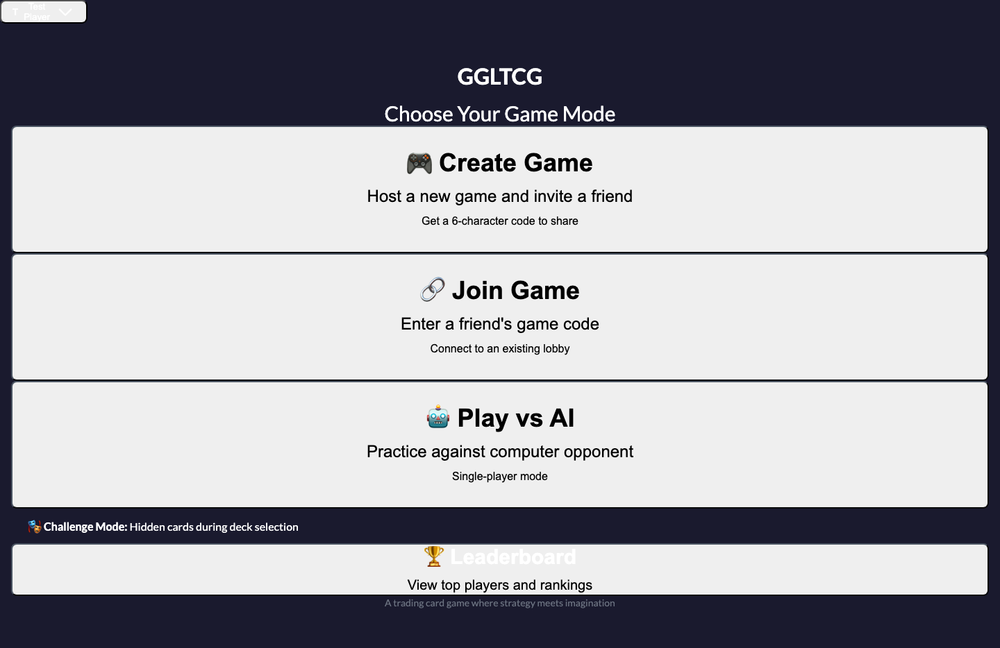
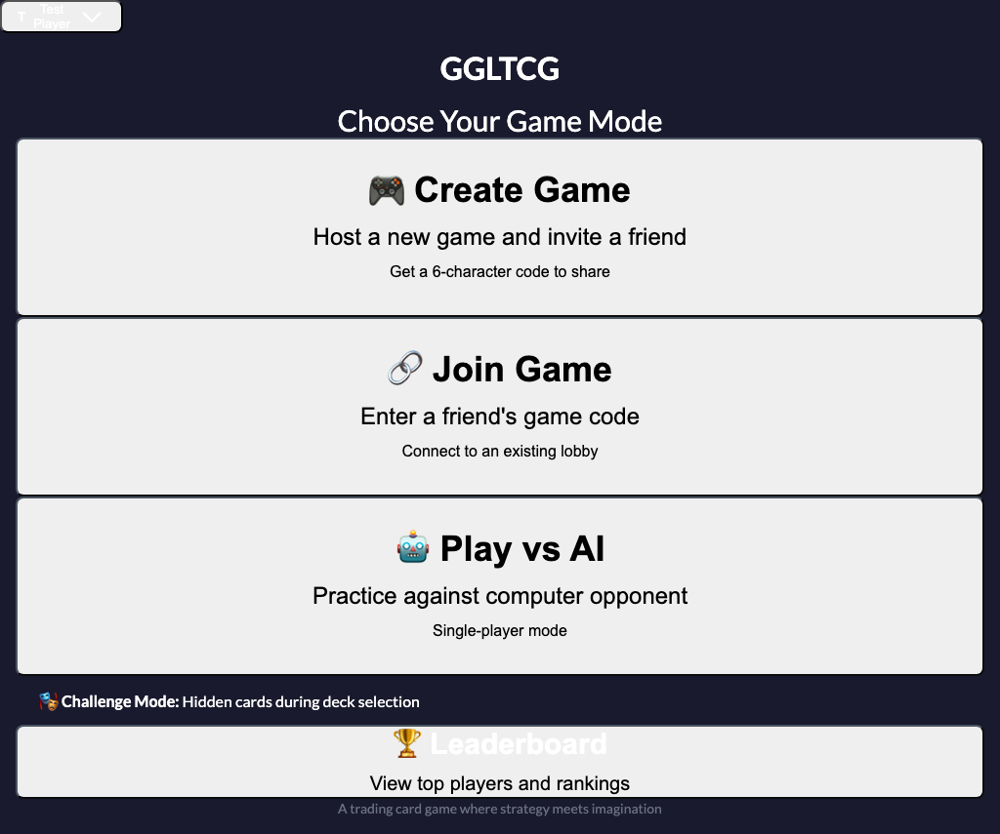
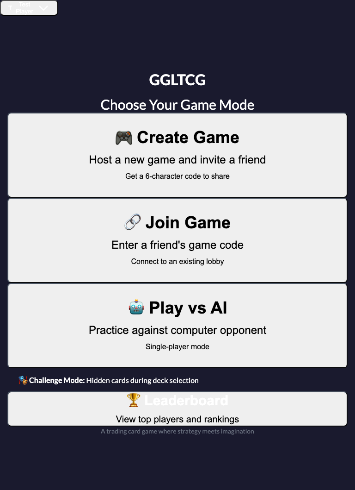
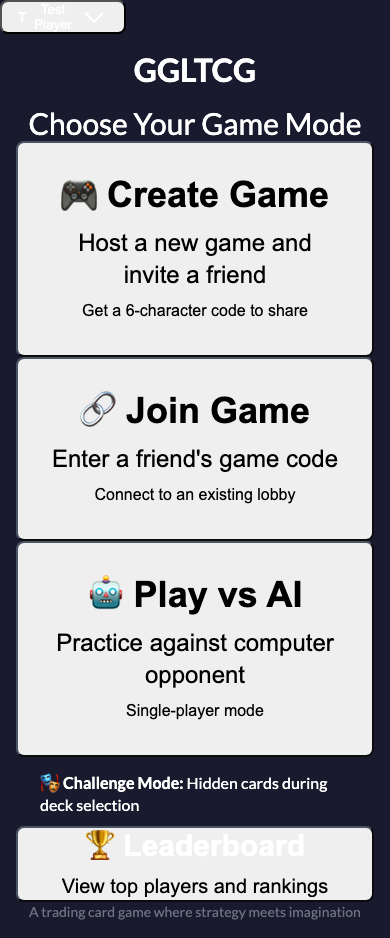
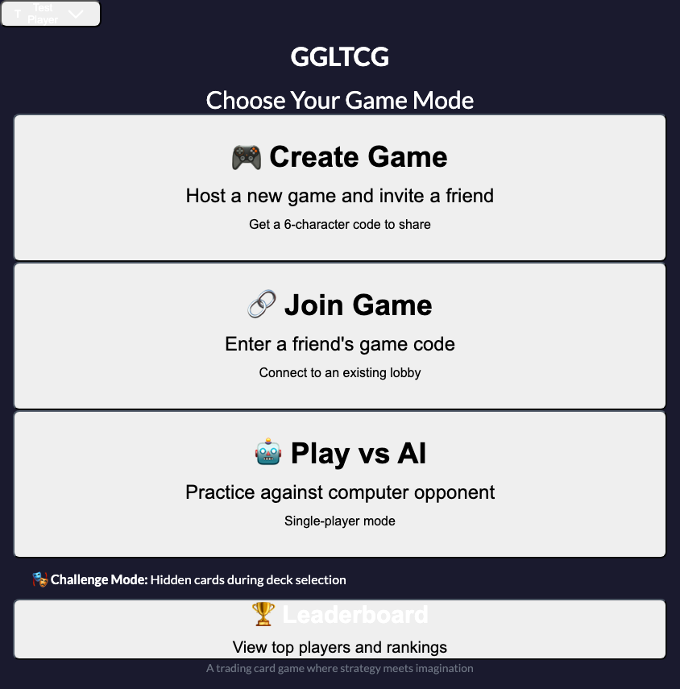
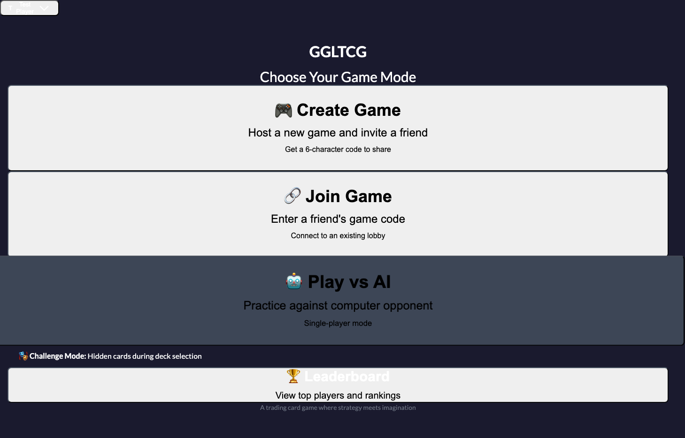
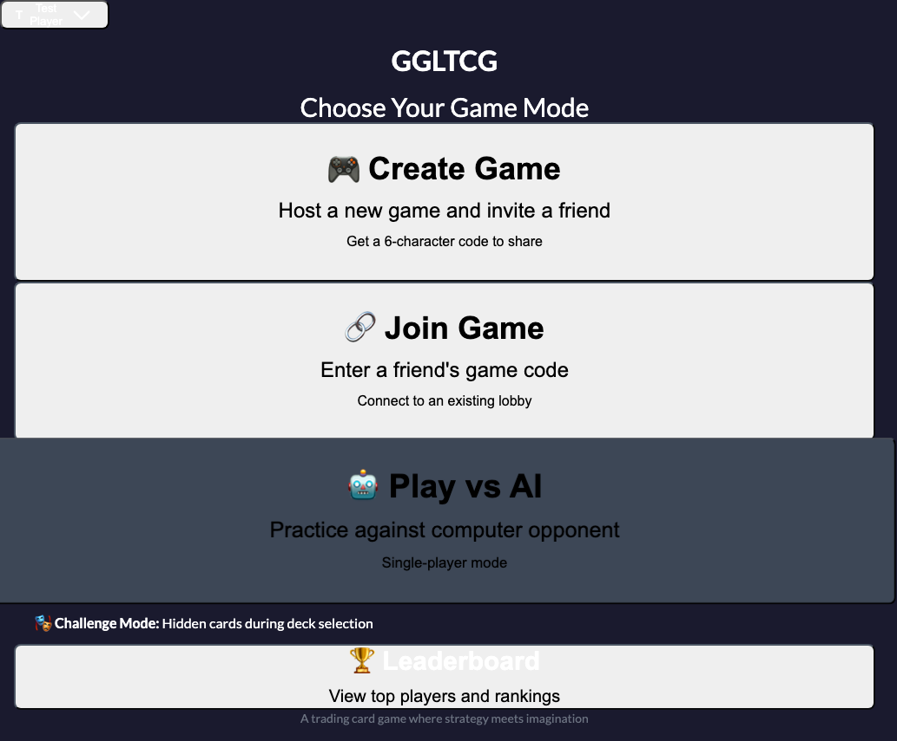
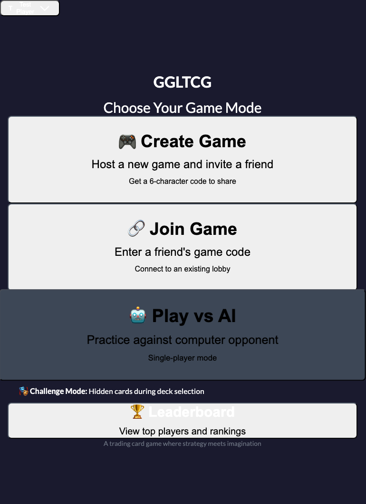
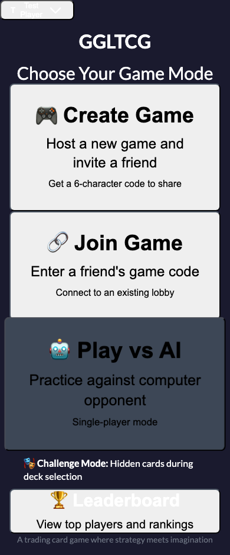
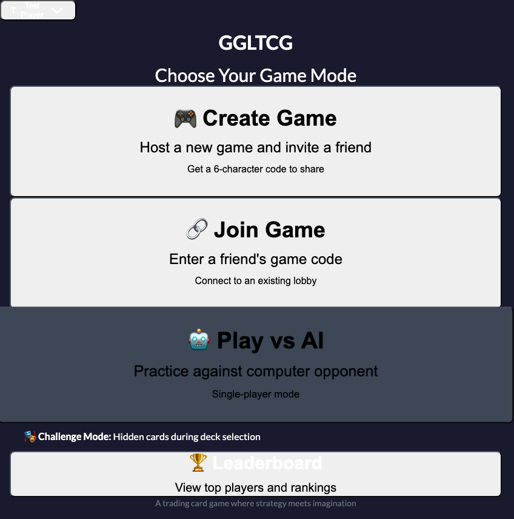

# GGLTCG UX Review - December 3, 2025

## Overview

This document captures UX observations, feedback, and improvement opportunities for the GGLTCG web application across multiple device types and screen sizes.

### Review Scope

- **Date**: December 3, 2025
- **Version**: Production build (ggltcg.vercel.app)
- **Devices Tested**:
  - Laptop (1440x900)
  - Tablet Landscape (1024x768)
  - Tablet Portrait (768x1024)
  - Phone Portrait (390x844 - iPhone 13)
  - Phone Landscape (844x390 - iPhone 13)

### Screenshot Organization

Screenshots are organized by viewport size in `screenshots/` subdirectories:
- `laptop-1440x900/` - Automated screenshots at standard laptop resolution
- `laptop-2880x1800/` - **High-resolution manual screenshots** (2x scale) - detailed gameplay states
- `tablet-landscape-1024x768/`
- `tablet-portrait-768x1024/`
- `phone-portrait-390x844/`
- `phone-landscape-844x390/`

**Note**: The `laptop-2880x1800/` folder contains manually captured screenshots at high resolution (2880x1800), focusing on specific gameplay scenarios not captured in automated tests: target selection modals, cards in play/sleep zones, tussle states, activated abilities, and victory screens.

---

## 1. Landing/Load Screen

**Purpose**: First impression, branding, and initial user journey

### Screenshots
- Laptop: 
- Tablet (Landscape): 
- Tablet (Portrait): 
- Phone (Portrait): 
- Phone (Landscape): 

### Observations

#### Laptop (1440x900)
- [ ] **Branding**: Copyright notice present/absent?
- [ ] **Layout**: Centered, balanced, professional?
- [ ] **CTA Clarity**: Primary action clearly visible?
- [ ] **Visual Hierarchy**: Clear information flow?

#### Tablet Landscape (1024x768)
- [ ] **Adaptation**: Layout adapts well to reduced width?
- [ ] **Touch Targets**: Buttons appropriately sized for touch?
- [ ] **Readability**: Text remains legible?

#### Tablet Portrait (768x1024)
- [ ] **Vertical Layout**: Content stacks appropriately?
- [ ] **Scrolling**: Is scrolling required? Excessive?
- [ ] **Navigation**: Navigation remains accessible?

#### Phone Portrait (390x844)
- [ ] **Mobile Optimization**: Is the layout usable on phone?
- [ ] **Text Size**: Can text be read without zooming?
- [ ] **Button Size**: Are buttons easily tappable?
- [ ] **Information Density**: Is too much/too little shown?

#### Phone Landscape (844x390)
- [ ] **Horizontal Constraints**: Does layout break?
- [ ] **Playability**: Can the game be played in this orientation?
- [ ] **Recommendation**: Should this orientation be supported?

### Issues & Improvements
- **Critical**: 
- **Important**: 
- **Nice to Have**: 

---

## 2. Lobby: Create Game

**Purpose**: User initiates new game, selects options

### Screenshots
- Laptop: 
- Tablet (Landscape): 
- Tablet (Portrait): 
- Phone (Portrait): 
- Phone (Landscape): 

### Observations

#### Cross-Platform
- [ ] **Options Visibility**: Game creation options clearly presented?
- [ ] **Mode Selection**: Single/Multiplayer options intuitive?
- [ ] **Visual Feedback**: Active selections clearly indicated?

### Issues & Improvements
- **Critical**: 
- **Important**: 
- **Nice to Have**: 

---

## 3. Lobby: Join Game

**Purpose**: User joins existing multiplayer game via code

### Screenshots
- Laptop: 
- Tablet (Landscape): 
- Tablet (Portrait): 
- Phone (Portrait): 
- Phone (Landscape): 

### Observations

#### Cross-Platform
- [ ] **Code Input**: Input field appropriately sized?
- [ ] **Error Handling**: Invalid code feedback clear?
- [ ] **Instructions**: User knows what to do?

### Issues & Improvements
- **Critical**: 
- **Important**: 
- **Nice to Have**: 

---

## 4. Lobby: Waiting for Opponent

**Purpose**: Hold state while waiting for second player to join

### Screenshots
- Laptop: 
- Tablet (Landscape): 
- Tablet (Portrait): 
- Phone (Portrait): 
- Phone (Landscape): 

### Observations

#### Cross-Platform
- [ ] **Status Clarity**: User knows what's happening?
- [ ] **Code Display**: Game code easily visible/copyable?
- [ ] **Cancel Option**: Can user back out?

### Issues & Improvements
- **Critical**: 
- **Important**: 
- **Nice to Have**: 

---

## 5. Game Board: Initial State (Turn 1, Start Phase)

**Purpose**: First turn experience, learning the UI

### Screenshots
- Laptop: 
- Tablet (Landscape): 
- Tablet (Portrait): 
- Phone (Portrait): 
- Phone (Landscape): 

### Observations

#### Information Architecture
- [ ] **Zone Organization**: Hand, Play Zone, Sleep Zone clearly distinct?
- [ ] **Player Indicators**: Clear who is who (you vs opponent)?
- [ ] **Resource Display**: CC (currency) clearly visible?
- [ ] **Phase Indicator**: Current phase obvious?
- [ ] **Turn Indicator**: Whose turn it is clear?

#### Visual Design
- [ ] **Color Coding**: Effective use of color to distinguish elements?
- [ ] **Card Readability**: Can card text/stats be read?
- [ ] **Spacing**: Elements have breathing room?
- [ ] **Contrast**: Sufficient contrast for readability?

### Issues & Improvements
- **Critical**: 
- **Important**: 
- **Nice to Have**: 

---

## 6. Game Board: Hand View with Cards

**Purpose**: Primary interaction - viewing and selecting cards to play

### Screenshots
- Laptop: 
- Tablet (Landscape): 
- Tablet (Portrait): 
- Phone (Portrait): 
- Phone (Landscape): 

### Observations

#### Card Display
- [ ] **Card Size**: Appropriate for viewport?
- [ ] **Card Details**: Name, cost, effect visible without interaction?
- [ ] **Card Count**: Can see all cards without scrolling?
- [ ] **Selection Affordance**: Clear how to select/play a card?

### Issues & Improvements
- **Critical**: 
- **Important**: 
- **Nice to Have**: 

---

## 7. Game Board: Card Selected/Hover State

**Purpose**: Interaction feedback when examining cards

### Screenshots
- Laptop: 
- Tablet (Landscape): 
- Tablet (Portrait): 
- Phone (Portrait): 
- Phone (Landscape): 

### Observations

#### Interaction Feedback
- [ ] **Hover Effect**: Clear visual change on hover (desktop)?
- [ ] **Selected State**: Selected card visually distinct?
- [ ] **Detail View**: Enlarged view shows all necessary info?
- [ ] **Touch Behavior**: On mobile, tap behavior intuitive?

### Issues & Improvements
- **Critical**: 
- **Important**: 
- **Nice to Have**: 

---

## 8. Game Board: Main Phase with Actions

**Purpose**: Primary gameplay phase where most actions occur

### Screenshots
- Laptop: 
- Tablet (Landscape): 
- Tablet (Portrait): 
- Phone (Portrait): 
- Phone (Landscape): 

### Observations

#### Action Clarity
- [ ] **Available Actions**: What can be done is obvious?
- [ ] **Action Buttons**: Play, Tussle, End Phase buttons clear?
- [ ] **Disabled States**: Unavailable actions grayed out/hidden?
- [ ] **Tutorial/Help**: First-time users have guidance?

### Issues & Improvements
- **Critical**: 
- **Important**: 
- **Nice to Have**: 

---

## 9. Game Board: Cards in Play

**Purpose**: Board state with multiple cards deployed

### Screenshots
- Laptop: 
- Tablet (Landscape): 
- Tablet (Portrait): 
- Phone (Portrait): 
- Phone (Landscape): 

### Observations

#### Board State
- [ ] **Card Organization**: Cards arranged clearly in play zones?
- [ ] **Card Overlapping**: Multiple cards handled well?
- [ ] **Stat Visibility**: Card stats (speed/strength/stamina) readable?
- [ ] **Status Effects**: Buffs/debuffs clearly indicated?
- [ ] **Targeting**: Can identify which cards can be targeted?

### Issues & Improvements
- **Critical**: 
- **Important**: 
- **Nice to Have**: 

---

## 10. Game Board: Target Selection Modal

**Purpose**: Selecting targets for card effects (Wake, Sun, Copy, etc.)

### Screenshots
- Laptop: 
- Tablet (Landscape): 
- Tablet (Portrait): 
- Phone (Portrait): 
- Phone (Landscape): 

### Observations

#### Modal UX
- [ ] **Modal Presence**: Clear that modal is open?
- [ ] **Instruction Text**: User knows what to select?
- [ ] **Valid Targets**: Only valid targets selectable?
- [ ] **Confirm/Cancel**: Actions clearly available?
- [ ] **Backdrop**: Background appropriately dimmed?

### Issues & Improvements
- **Critical**: 
- **Important**: 
- **Nice to Have**: 

---

## 11. Game Board: Mid-Game State

**Purpose**: Board complexity after several turns

### Screenshots
- Laptop: 
- Tablet (Landscape): 
- Tablet (Portrait): 
- Phone (Portrait): 
- Phone (Landscape): 

### Observations

#### Complexity Handling
- [ ] **Information Overload**: Too much information at once?
- [ ] **Scrolling**: Excessive scrolling required?
- [ ] **Zone Organization**: Zones remain distinct with many cards?
- [ ] **Performance**: UI remains responsive?

### Issues & Improvements
- **Critical**: 
- **Important**: 
- **Nice to Have**: 

---

## 12. Game Board: Play-by-Play Log

**Purpose**: Game history and AI reasoning display

### Screenshots
- Laptop: 
- Tablet (Landscape): 
- Tablet (Portrait): 
- Phone (Portrait): 
- Phone (Landscape): 

### Observations

#### Log Usability
- [ ] **Visibility**: Log easily found?
- [ ] **Readability**: Text size and contrast adequate?
- [ ] **Scrolling**: Log scrolls independently?
- [ ] **Content**: Recent actions clearly summarized?
- [ ] **AI Reasoning**: AI thought process interesting/useful?

### Issues & Improvements
- **Critical**: 
- **Important**: 
- **Nice to Have**: 

---

## 13. Victory Screen

**Purpose**: End game experience, celebration, replay option

### Screenshots
- Laptop: 
- Tablet (Landscape): 
- Tablet (Portrait): 
- Phone (Portrait): 
- Phone (Landscape): 

### Observations

#### Victory Experience
- [ ] **Celebration**: Victory feels rewarding?
- [ ] **Game Summary**: Stats/highlights shown?
- [ ] **Play-by-Play**: Full game history accessible?
- [ ] **Next Steps**: Replay/New Game options clear?

### Issues & Improvements
- **Critical**: 
- **Important**: 
- **Nice to Have**: 

---

## 14. Responsive Layout (Full Page)

**Purpose**: Overall layout assessment at each viewport

### Screenshots
- Laptop: 
- Tablet (Landscape): 
- Tablet (Portrait): 
- Phone (Portrait): 
- Phone (Landscape): 

### Observations

#### Overall Layout
- [ ] **Viewport Utilization**: Good use of available space?
- [ ] **Scrolling**: Scroll behavior appropriate?
- [ ] **Fixed Elements**: Headers/footers behave correctly?
- [ ] **Breakpoints**: Transitions between sizes graceful?

### Issues & Improvements
- **Critical**: 
- **Important**: 
- **Nice to Have**: 

---

## 15. High-Resolution Gameplay Screenshots (2880x1800)

**Purpose**: Detailed examination of key gameplay UX elements at high resolution

These screenshots were manually captured at 2880x1800 resolution to capture specific gameplay scenarios and UI interactions that require detailed review.

### 15.1 Cards in Play and Sleep Zones


**Observations**:
- [ ] **Zone Distinction**: Play zone vs sleep zone clearly separated?
- [ ] **Card Layout**: Multiple cards displayed without overlap issues?
- [ ] **Stat Visibility**: Card stats (speed/strength/stamina) easily readable?
- [ ] **Visual Hierarchy**: Active cards vs sleeped cards clearly distinguished?

### 15.2 Target Selection Modal - Twist (No Selection)


**Observations**:
- [ ] **Modal Clarity**: Clear that user needs to select a target?
- [ ] **Instructions**: Text explains what Twist does?
- [ ] **Valid Targets**: Only valid targets highlighted/selectable?
- [ ] **Cancel Option**: Easy to back out of action?

### 15.3 Target Selection Modal - Twist (Knight Selected)


**Observations**:
- [ ] **Selection Feedback**: Selected card visually distinct?
- [ ] **Confirm Action**: Clear how to confirm the selection?
- [ ] **Preview**: Shows effect of selection before confirming?

### 15.4 Cards with Tussle Available (Green Highlighting)


**Observations**:
- [ ] **Action Indicators**: Green highlighting clearly indicates available actions?
- [ ] **Color Choice**: Green is accessible (colorblind-friendly)?
- [ ] **Clarity**: User understands which cards can tussle?

### 15.5 Target Selection Modal - Copy (No Selection)


**Observations**:
- [ ] **Copy Mechanics**: User understands they're copying an effect?
- [ ] **Valid Targets**: Clear which cards can be copied?

### 15.6 Target Selection Modal - Copy (Archer Selected)


**Observations**:
- [ ] **Selection Preview**: Shows what will happen when copying Archer?
- [ ] **Confirmation**: Confirm button prominent and clear?

### 15.7 Board State with Copied Archer Card


**Observations**:
- [ ] **Copy Indication**: Clear that card is a copy, not original?
- [ ] **Effect Understanding**: User understands the copied card's abilities?
- [ ] **Board Clarity**: Copied card doesn't create confusion?

### 15.8 Green Action Indicators - Archer Activated Abilities


**Observations**:
- [ ] **Activated Abilities**: Clear that Archer has special actions available?
- [ ] **Visual Differentiation**: Activated abilities vs regular actions distinct?
- [ ] **User Guidance**: Player knows how to use Archer's ability?

### 15.9 Tussle Target Selection (Knight as Attacker)


**Observations**:
- [ ] **Attacker Clarity**: Clear which card is attacking?
- [ ] **Defender Selection**: Valid defenders appropriately indicated?
- [ ] **Combat Preview**: Shows predicted outcome?

### 15.10 Target Selection Modal - Wake (No Selection)


**Observations**:
- [ ] **Wake Mechanics**: User understands Wake brings cards back from sleep?
- [ ] **Target Pool**: Only sleeped cards shown as valid targets?

### 15.11 Target Selection Modal - Wake (Ka Selected)


**Observations**:
- [ ] **Selection Clarity**: Ka is clearly highlighted as selected?
- [ ] **Effect Preview**: Shows Ka will return to play?

### 15.12 Complex Board State (Turn 6, Four Action Types)


**Observations**:
- [ ] **Action Panel**: All 4 action types clearly presented?
- [ ] **Information Density**: Not overwhelming with many options?
- [ ] **Decision Making**: User can easily choose next action?

### 15.13 Activated Ability Target - Archer Targeting Dream


**Observations**:
- [ ] **Ability Clarity**: Clear this is Archer's special ability?
- [ ] **Target Selection**: Dream is valid target, clearly shown?
- [ ] **Effect Description**: User knows what will happen?

### 15.14 Victory Screen - Factual Mode


**Observations**:
- [ ] **Victory Celebration**: Feels rewarding?
- [ ] **Game Summary**: Key stats shown?
- [ ] **Next Actions**: Replay/New Game options clear?

### 15.15 Victory Screen - Story Mode Loading


**Observations**:
- [ ] **Loading State**: Clear that story is being generated?
- [ ] **Progress Indicator**: User knows to wait?
- [ ] **Visual Design**: Loading state polished?

### 15.16 Victory Screen - Story Mode


**Observations**:
- [ ] **Story Quality**: AI-generated story engaging?
- [ ] **Readability**: Text readable and well-formatted?
- [ ] **Replay Value**: Story mode adds to experience?
- [ ] **Actions**: Can share, save, or dismiss story easily?

### High-Resolution Screenshots: Overall Assessment

**Strengths**:
- 

**Areas for Improvement**:
- 

**Critical Issues**:
- 

---

## Cross-Cutting Concerns

### Accessibility
- [ ] Color contrast meets WCAG AA standards
- [ ] Keyboard navigation functional
- [ ] Screen reader friendly (semantic HTML)
- [ ] Touch target sizes (minimum 44x44px)

### Performance
- [ ] Initial load time acceptable
- [ ] Animations smooth (60fps)
- [ ] No layout shifts (CLS)
- [ ] Images optimized

### Branding & Polish
- [ ] Copyright notice present
- [ ] Consistent color scheme
- [ ] Professional appearance
- [ ] Delightful details

---

## Priority Issues Summary

### Critical (Blocks Core Experience)
1. 
2. 
3. 

### Important (Degrades Experience)
1. 
2. 
3. 

### Nice to Have (Polish & Enhancement)
1. 
2. 
3. 

---

## Device Recommendations

### Laptop (1440x900)
**Recommendation**: ✅ Fully supported / ⚠️ Needs work / ❌ Not recommended

**Reasoning**: 

### Tablet Landscape (1024x768)
**Recommendation**: ✅ Fully supported / ⚠️ Needs work / ❌ Not recommended

**Reasoning**: 

### Tablet Portrait (768x1024)
**Recommendation**: ✅ Fully supported / ⚠️ Needs work / ❌ Not recommended

**Reasoning**: 

### Phone Portrait (390x844)
**Recommendation**: ✅ Fully supported / ⚠️ Needs work / ❌ Not recommended

**Reasoning**: 

### Phone Landscape (844x390)
**Recommendation**: ✅ Fully supported / ⚠️ Needs work / ❌ Not recommended

**Reasoning**: 

---

## Next Steps

1. [ ] Capture all screenshots using `npm run screenshots`
2. [ ] Review screenshots and fill in observations
3. [ ] Prioritize issues by severity
4. [ ] Create GitHub issues for critical/important items
5. [ ] Plan UX improvement sprint

---

## Appendix: Screenshot Capture Process

To regenerate screenshots:

```bash
cd frontend
npm run screenshots          # Run all viewports headless
npm run screenshots:headed   # Run with visible browser
npm run screenshots:ui       # Run with Playwright UI for debugging
```

Screenshots are saved to `docs/ux-review/screenshots/{viewport}/` automatically.
